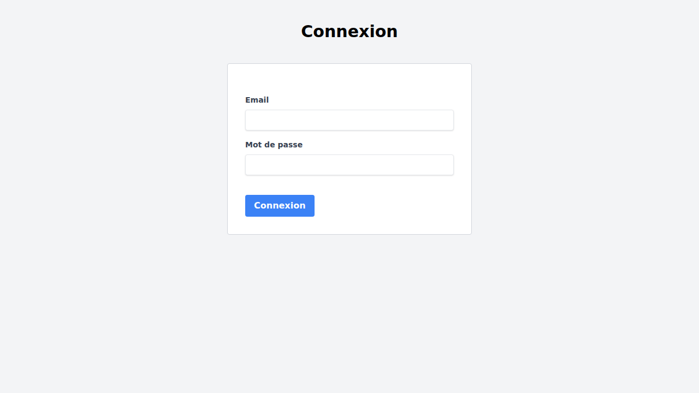
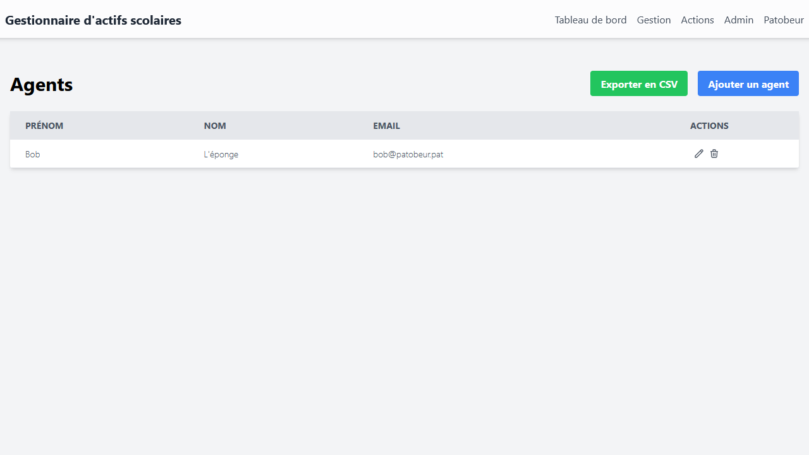
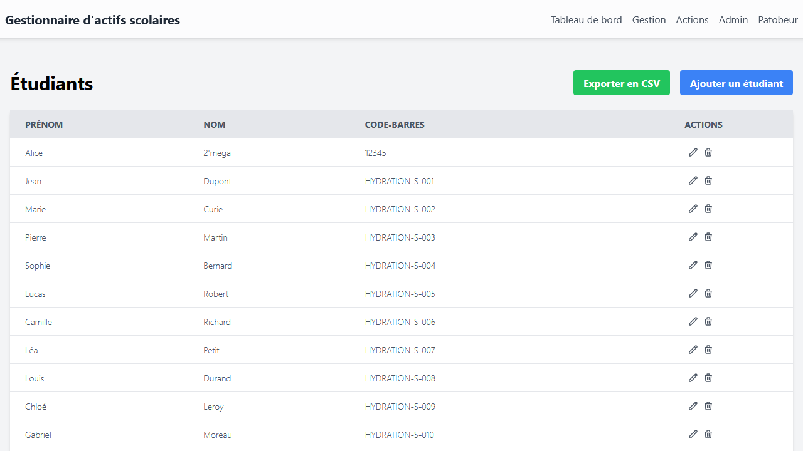
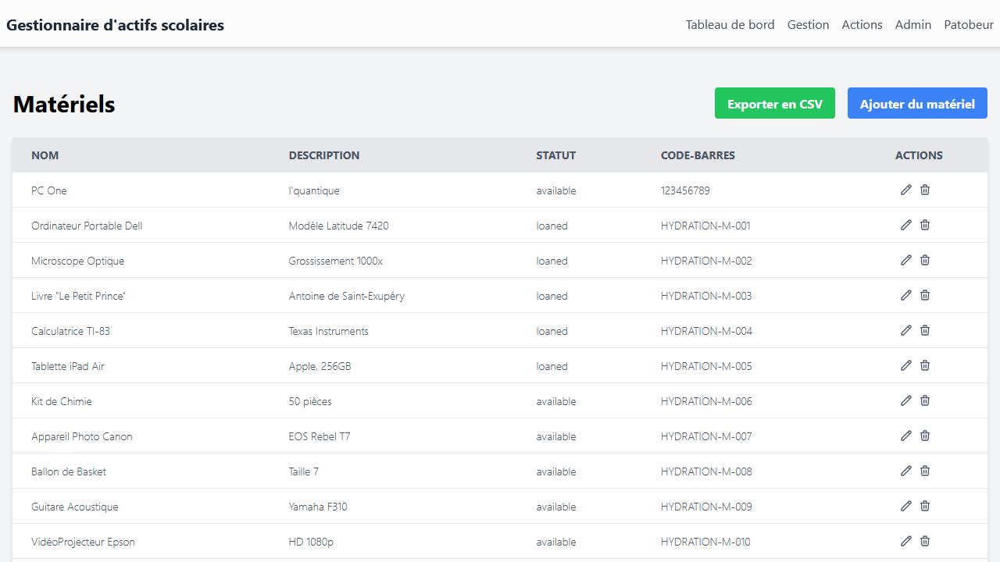
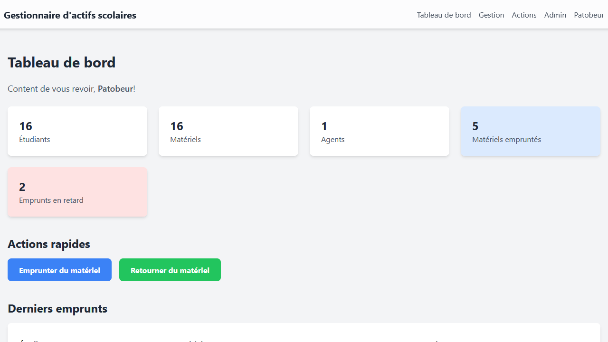

# assets_manager

**assets_manager** est une application web conçue pour gérer les prêts de matériel au sein d'une école ou d'une organisation. Elle offre une interface conviviale aux administrateurs et aux agents pour suivre le matériel, gérer les informations sur les prêts de matériels. L'application est développée en PHP et utilise une base de données MySQL pour stocker les données.

## Fonctionnalités

L'application offre une gamme complète d'outils pour une gestion simple et efficace du matériel.

### Gestion des Entités

Le système permet une gestion complète (CRUD : Créer, Lire, Mettre à jour, Supprimer) des différentes entités de l'application :

-  **Utilisateurs** : Création, modification et suppression des comptes utilisateurs, avec attribution des rôles `administrateur` ou `agent`.
-  **Étudiants** : Gestion des profils étudiants, incluant leurs informations personnelles (nom, prénom, email) et leur appartenance à une promotion et une section.
-  **Matériels** : Suivi du parc de matériel, avec nom, description, statut (`disponible`, `prêté`, `en maintenance`) et code-barres unique.
-  **Promotions et Sections** : Organisation des étudiants par promotions (ex: "2025-2027") et sections (ex: "BTS SIO"), entièrement configurables.

### Processus de Prêt et Retour

-  **Interface Simplifiée** : Des pages dédiées pour enregistrer les prêts et les retours en scannant simplement le code-barres de l'étudiant et du matériel.
-  **Mise à jour Automatique** : Le statut du matériel est automatiquement mis à jour à `prêté` lors d'un emprunt et à `disponible` lors d'un retour.
-  **Confirmation Visuelle** : Après chaque opération, un résumé s'affiche, confirmant l'action et montrant les détails du prêt ou du retour, ainsi que l'historique récent de l'étudiant.

### Suivi et Historique

-  **Tableau de Bord** : Affiche en temps réel les prêts en cours, avec une mise en évidence visuelle des prêts de longue durée.
-  **Historique Global** : Une vue complète de tous les prêts (passés et en cours), avec des informations détaillées sur l'étudiant, le matériel, les dates et les agents ayant traité les opérations.
-  **Pages de Détails** : Chaque étudiant et chaque matériel dispose de sa propre page de détails, affichant ses informations complètes ainsi que son historique de prêts personnel.

### Import et Export de Données

-  **Import CSV** : Importez en masse des listes d'étudiants et de matériel. Le système associe automatiquement les étudiants à leur promotion et section en se basant sur leur nom, simplifiant la préparation des données.
-  **Export CSV** : Exportez facilement les listes complètes des étudiants, du matériel, des agents et même l'historique complet des prêts pour une analyse externe ou des archives.
-  **Fichiers d'Exemple** : Des modèles de fichiers CSV sont fournis pour garantir un formatage correct des données à importer.

### Fonctionnalités Administratives

-  **Hydratation des Données** : Une fonctionnalité réservée aux administrateurs pour peupler la base de données avec un jeu de données de démonstration (étudiants, matériels, prêts) et pour la nettoyer en un clic. Idéal pour les démonstrations ou les tests.
-  **Gestion des Rôles** : Seuls les administrateurs peuvent créer, modifier ou supprimer d'autres utilisateurs, ainsi que gérer les promotions et les sections.

### Internationalisation

-  **Support Multilingue** : L'interface est disponible en français et en anglais. Le système de traduction est conçu pour être facilement extensible à d'autres langues via de simples fichiers de configuration (JSON).
-  **Sélecteur de Langue** : Un sélecteur de langue discret (`FR | EN`) est présent dans le menu principal pour permettre aux utilisateurs de changer de langue à tout moment, tout en conservant le contexte de la page actuelle.

### Import de Données via CSV

L'application permet d'importer des listes d'étudiants et de matériel en utilisant des fichiers CSV. Cette fonctionnalité est accessible aux administrateurs depuis les pages de gestion des étudiants et du matériel.

**Important :** Pour que l'importation fonctionne correctement, l'ordre des colonnes dans votre fichier CSV doit impérativement correspondre au format attendu par l'application. La première ligne du fichier (contenant les en-têtes) est ignorée lors de l'importation.

-  **Format pour les étudiants :**

   1. `Prénom`
   2. `Nom`
   3. `Email`
   4. `Promo` (le nom de la promotion, ex: "25-27")
   5. `Section` (le nom de la section, ex: "BTS COM")
   6. `Code-barres`

-  **Format pour le matériel :**
   1. `Nom`
   2. `Description`
   3. `Statut` (doit être `available`, `loaned`, ou `maintenance`)
   4. `Code-barres`

Des fichiers d'exemple sont disponibles au téléchargement directement depuis l'interface d'importation pour vous aider à préparer vos données.

## Stack Technologique

-  **Backend**: PHP
-  **Base de données**: MySQL
-  **Frontend**: HTML, Tailwind CSS, JavaScript
-  **Serveur web**: Apache ou Nginx (peut également être exécuté avec le serveur web intégré de PHP pour le développement)

## Aperçu

| Page de Connexion                           | Page des Utilisateurs                            |
| ------------------------------------------- | ------------------------------------------------ |
|  |  |

| Page des Étudiants                              | Page du Matériel                               |
| ----------------------------------------------- | ---------------------------------------------- |
|  |  |

| Tableau de Bord                               |
| --------------------------------------------- |
|  |

## Installation

L'installation a été conçue pour être aussi simple et flexible que possible, que ce soit sur un serveur local ou en ligne.

### 1. Prérequis

-  Un serveur web (Apache, Nginx, etc.) avec PHP 8 ou supérieur.
-  Un serveur de base de données MySQL ou MariaDB.
-  L'extension PHP `php-mysql` doit être activée pour permettre à PHP de communiquer avec la base de données.

### 2. Structure des Fichiers

Pour une sécurité optimale, il est **fortement recommandé** de placer le dossier de configuration en dehors du répertoire public de votre site web.

Voici la structure de dossiers recommandée :

```
/chemin/vers/votre/hebergement/
├── config_assets_manager/   <-- Le dossier de configuration
└── public_html/             <-- La racine de votre site web (ou www, htdocs...)
    └── assets_manager/      <-- Le dossier de l'application
```

-  **`config_assets_manager/`** : Contient les fichiers de configuration sensibles, les modèles de pages, etc.
-  **`public_html/`** (ou équivalent) : C'est le seul dossier accessible depuis internet.
-  **`assets_manager/`** : C'est le dossier que vous avez cloné depuis ce dépôt. Vous pouvez le renommer comme vous le souhaitez.

### 3. Processus d'Installation

1. **Téléversez les fichiers** : Placez les dossiers `config_assets_manager` et `assets_manager` sur votre serveur en respectant la structure recommandée ci-dessus.

2. **Créez une base de données** : À l'aide d'un outil comme phpMyAdmin ou la ligne de commande, créez une base de données vide pour l'application.

3. **Lancez l'installateur** : Ouvrez votre navigateur et accédez à l'URL de l'application. Par exemple :

   -  **En ligne** : `http://votredomaine.com/assets_manager/public/`
   -  **En local** : `http://localhost/assets_manager/public/`

   Vous serez automatiquement redirigé vers la page d'installation.

4. **Suivez les étapes** :
   -  Le script va **automatiquement détecter** l'emplacement du dossier `config_assets_manager`. Il affichera le chemin trouvé pour confirmation.
   -  Remplissez les informations de connexion à la base de données que vous venez de créer.
   -  Créez le compte administrateur principal.
   -  Cliquez sur "Installer".

Et voilà ! L'application est prête à être utilisée. Le script a automatiquement créé les fichiers de configuration nécessaires (`config.php` et `bootstrap.php`) au bon endroit.

### 4. Installation en local (alternative avec le serveur PHP)

Pour un développement rapide en local, vous pouvez utiliser le serveur web intégré de PHP.

1. Clonez le dépôt.
2. Assurez-vous que la structure des dossiers (`config_assets_manager` et `assets_manager` au même niveau) est respectée.
3. Lancez le serveur depuis le dossier `assets_manager` :
   ```bash
   php -S 127.0.0.1:8080 -t public/
   ```
4. Ouvrez `http://127.0.0.1:8080` dans votre navigateur pour lancer l'installation.

## Schéma de la Base de Données

La base de données est composée de plusieurs tables qui assurent la gestion des utilisateurs, des étudiants, du matériel et des prêts.

-  **`am_users`**: Stocke les informations des utilisateurs de l'application.

   -  `id`: Clé primaire (INT)
   -  `first_name`: Prénom de l'utilisateur (VARCHAR)
   -  `last_name`: Nom de l'utilisateur (VARCHAR)
   -  `email`: Email de l'utilisateur, utilisé pour la connexion (VARCHAR, unique)
   -  `password`: Mot de passe haché (VARCHAR)
   -  `role`: Rôle de l'utilisateur (`agent` ou `admin`) (ENUM)

-  **`am_promos`**: Table des promotions (ex: "25-27").

   -  `id`: Clé primaire (INT)
   -  `title`: Nom de la promotion (VARCHAR)

-  **`am_sections`**: Table des sections (ex: "BTS COM").

   -  `id`: Clé primaire (INT)
   -  `title`: Nom de la section (VARCHAR)

-  **`am_students`**: Stocke les informations des étudiants.

   -  `id`: Clé primaire (INT)
   -  `first_name`: Prénom de l'étudiant (VARCHAR)
   -  `last_name`: Nom de l'étudiant (VARCHAR)
   -  `barcode`: Code-barres unique de l'étudiant (VARCHAR, unique)
   -  `email`: Email de l'étudiant (VARCHAR, unique)
   -  `promo_id`: Clé étrangère référençant `am_promos(id)`
   -  `section_id`: Clé étrangère référençant `am_sections(id)`

-  **`am_materials`**: Stocke les informations sur le matériel.

   -  `id`: Clé primaire (INT)
   -  `name`: Nom du matériel (VARCHAR)
   -  `description`: Description détaillée du matériel (TEXT)
   -  `status`: Statut du matériel (`available`, `loaned`, `maintenance`) (ENUM)
   -  `barcode`: Code-barres unique du matériel (VARCHAR, unique)

-  **`am_loans`**: Table de jonction qui enregistre tous les prêts.
   -  `id`: Clé primaire (INT)
   -  `student_id`: Clé étrangère référençant `am_students(id)`
   -  `material_id`: Clé étrangère référençant `am_materials(id)`
   -  `loan_date`: Date et heure du prêt (DATETIME)
   -  `return_date`: Date et heure du retour (DATETIME, peut être `NULL`)
   -  `loan_user_id`: Clé étrangère référençant `am_users(id)` (l'utilisateur qui a validé le prêt)
   -  `return_user_id`: Clé étrangère référençant `am_users(id)` (l'utilisateur qui a validé le retour, peut être `NULL`)
